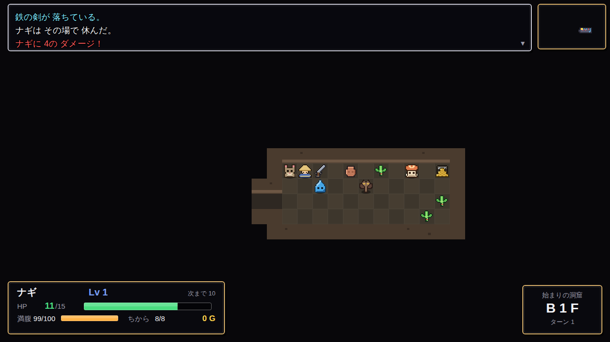
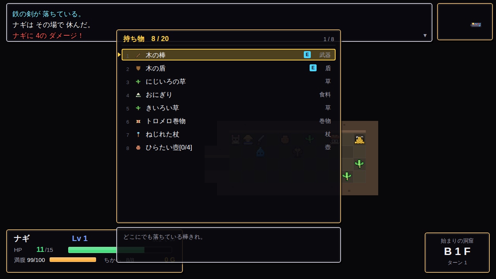

# 風の村と天輪の塔 ― 不思議のダンジョン

トルネコの大冒険 / 風来のシレン 系の **ターン制ローグライク**です。
操作方法と UI は **風来のシレン6 とぐろ島探検録** を参考にしています。

- **依存パッケージ ゼロ**（TypeScript + Canvas 2D + WebAudio だけ）
- バンドラなし。`tsc` で ES Modules に出力してブラウザが直接読み込みます
- 画像・音声のアセットもゼロ。ドット絵は文字グリッド、効果音と BGM は
  WebAudio で手続き的に合成しています



```
4 ダンジョン ＋ ラストダンジョン ＋ おまけの「もっと不思議のダンジョン」
```

| | ダンジョン | 階数 | 特徴 |
|---|---|---|---|
| D1 | 始まりの洞窟 | 5F | チュートリアル。モンスターハウスも風も出ない |
| D2 | せせらぎの森 | 10F | 水路。持ち物を盗む鳥。中ボス |
| D3 | 灼熱の火山 | 15F | 溶岩と炎。装備が錆びる |
| D4 | 常闇の地下水路 | 20F | 明かりの無い部屋。亡霊とレベルドレイン |
| DL | 天輪の塔 | 30F | ラストダンジョン。ボスは 2 形態 |
| EX | もっと不思議のダンジョン | 99F | **持ち込み不可・Lv1 スタート・倉庫も使えない** |

---

## 遊びかた

```bash
npm run build     # tsc で dist/ を生成
npm run serve     # http://localhost:8000 を開く
```

または `npm start`（ビルドしてサーバを起動）。

> ブラウザの ES Modules の制約で、`index.html` をファイルとして直接開くと
> 動きません。必ず HTTP サーバ経由で開いてください。

---

## 操作方法

シレン6 のボタン配置をキーボードへ写像しています。
**テンキーだけでも全操作が完結します。**

### 移動

| キー | 操作 |
|---|---|
| `↑ ↓ ← →` / `W A S D` | 8 方向へ歩く（2 キー同時押しで斜め） |
| テンキー `1 3 7 9` | 斜めへ直接歩く |
| `Q`（押しながら） | **斜め移動に固定**する |
| `R`（押しながら） | その場で**向きだけ**変える |
| `Shift` または `X` ＋ 方向 | **ダッシュ**（曲がり角・敵・アイテムで自動停止） |
| `.` | その場で 1 ターン待つ（長押しで連続） |

### 行動

| キー | 操作 |
|---|---|
| `Z` / `Enter` / `Space` | 決定 / 向いている方向へ攻撃 |
| 敵に向かって歩く | 攻撃する |
| `Shift` ＋ `.` | 階段を降りる |
| `F` | 足元メニュー（拾う・置く・買う・階段） |
| `1`〜`0` | その番号の道具をすぐ使う |

### メニューと画面

| キー | 操作 |
|---|---|
| `E` / `Esc` | メインメニュー |
| `I` | 持ち物を直接開く |
| `T` | 特殊メニュー（休む・名前をつける） |
| `C` | 作戦メニュー（仲間への指示） |
| `Tab`（押している間） | 全体図 |
| `M` | ミニマップ 通常 → 拡大 → 消す |
| `L` | これまでのできごと |
| `H` / `F1` | 操作ヘルプ |
| `Esc` / `BackSpace` / `X` | ひとつ戻る |

ゲームパッド（標準配置）にも対応しています。
**`Ctrl` / `Alt` / `Meta` は一切使いません**（ブラウザのショートカットと
衝突しないようにするためです）。



---

## ゲームの仕組み

### ターン制

プレイヤーが 1 回行動すると、敵も 1 回行動します。倍速の敵は 2 回、
鈍足の敵は 2 ターンに 1 回です。**待っている限り、世界も止まっています。**

### 満腹度

1 ターンに 0.1 ずつ減り、0 になると HP が減り続けます。
おにぎりを切らさないこと。

### 未識別アイテム

草・巻物・杖・壺・腕輪は、冒険のたびに見た目と中身の対応が
シャッフルされます。飲む・読む・店で売る・識別の巻物を読む、のいずれかで
正体が分かります。自分でメモ（「当たり」「危険」など）を付けられます。

### 印と合成

武器と盾には**印**を埋められます。合成の壺に入れると、
修正値が足され、素材の印が移ります。同じ印は重ねて強化でき、
そのときスロットは 1 つしか使いません。

### 死ぬということ

倒れると持ち物をすべて失います（**始まりの洞窟だけは例外**）。
倉庫に預けたものは失われません。
復活の草・復活の腕輪を持っていれば、一度だけ生き返れます。

---

## 開発

```bash
npm run typecheck   # 型検査のみ
npm test            # ビルドして node:test を実行
npm run watch       # 変更を監視してビルド
```

### 構成

```
src/
  core/      rng（シード付き）/ geom / types（契約）/ input / audio / save
  data/      items / monsters / dungeons / runes / traps / names / registry
  dungeon/   generator（区画分割）/ tilemap / fov / spawn
  game/      world / turn / actions / combat / status / hunger /
             inventory / itemEffects / itemActions / monsterAI /
             monsterSkills / trapEffects / run / town / death / rules
  ui/        theme / draw / log / fx / renderer / hud / minimap / menu /
             sprites / screens（title / town / dungeon / result / help）
  main.ts    起動とゲームループ
test/        node:test によるテスト
```

### 設計の方針

- **乱数はすべて `src/core/rng.ts` のシード付き RNG を通す。**
  ゲームロジックから `Math.random()` を呼ばないこと（再現性が壊れます）。
  演出だけは `fxRandom()` を使って構いません。
- **ロジックはアニメーションを待たない。**
  演出は `GameEvent` としてキューに積むだけで、描画側が自分のペースで
  消化します。入力が速ければ演出が追い越されるだけで、進行は詰まりません。
- **バランス調整の数値は `src/game/rules.ts` に集約**しています。
- **`import` には必ず `.js` 拡張子を付ける**こと（バンドラを使わないため）。
- データの追加は `src/data/` に足すだけです。`registry.ts` の
  `validateData()` が起動時に id の重複・参照切れ・印のスロット超過・
  仮名プールの不足を検査します。

### テスト

`npm test` で 124 件が走ります。主なもの:

- **ダンジョン生成**: 300 シードで全マスが連結していること。
  水路・溶岩・大部屋・円形・迷路・狭いマップでも不通のフロアが出ないこと
- **通しプレイ**: 6 ダンジョンをランダム操作で回し、毎ターン
  HP・満腹度・レベル・座標・アクターの重なり・床アイテムの重なりを検査
- **アイテム**: 全 190 種を「使う」「投げる」— 例外も不整合も起きないこと
- **効果 id**: アイテム・モンスター・ワナ・腕輪の効果 id に、
  必ず実装が対応していること（綴り間違いで黙って無効になるのを防ぐ）
- **操作**: キーの衝突が無いこと、修飾キーを使っていないこと、
  テンキーだけで全操作が完結すること

---

## ライセンス

MIT
